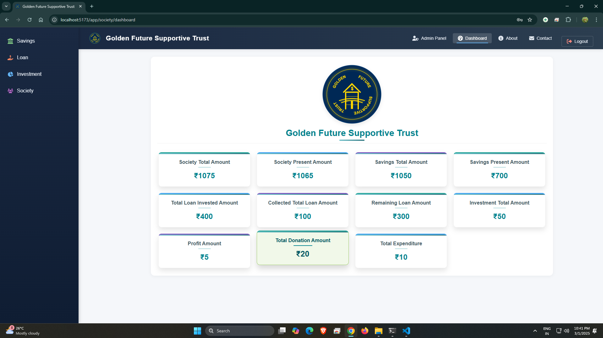
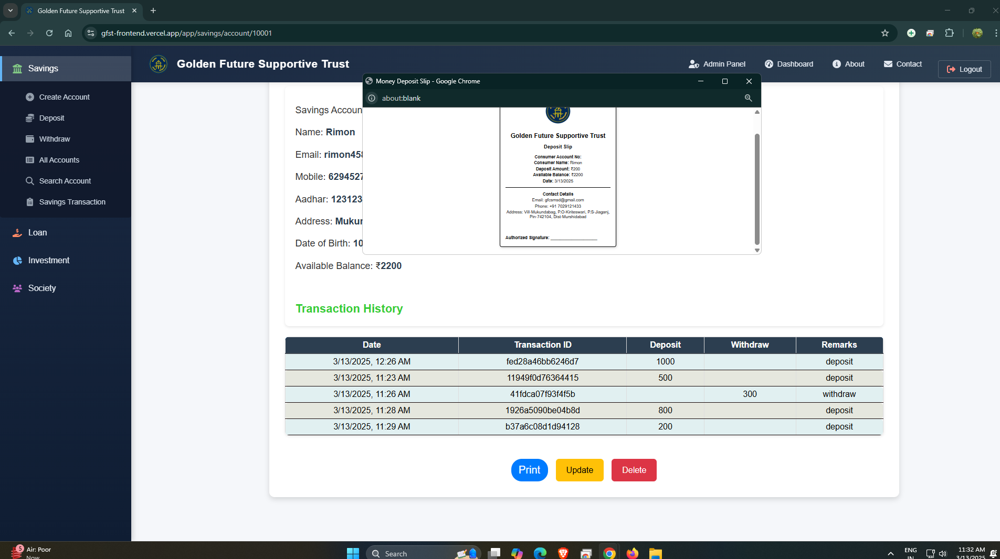
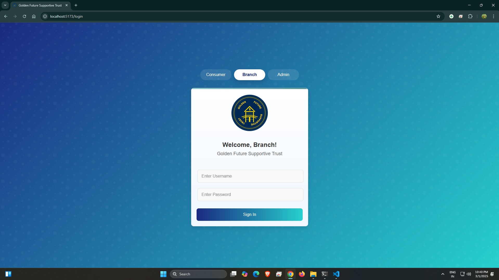

# 🏦 Golden Future Supportive Trust  

A financial management system developed using the MERN stack (MongoDB, Express.js, React.js, and Node.js).  
This project enables seamless account management, transactions, loan processing, and more while ensuring a secure and user-friendly experience. The main purpose of this project is our village for helping us and this project work with real world.

---

## 📸 Some snapshorts of my project

### 🔹 Dashboard Overview  
  

### 🔹 Profile with Transactions  
  

### 🔹 Login Page 
  

---

## 🚀 Features  

✅ **User Authentication** – Secure login system for customers, employees, and administrators.  
✅ **Savings Account Management** – Create accounts, deposit/withdraw funds, and track transaction history.  
✅ **Loan Management** – Apply for loans, manage repayments, and calculate EMI.  
✅ **Investment Tracking** – Monitor investments and financial growth and calculate profit also.  
✅ **Donations & Expenditures** – Maintain transparent records of donations and expenses.  
✅ **Automated Transaction Slips** – Generate and print Deposit/Withdrawal/Donations/Expenditure receipts.  
✅ **Dashboard Overview** – Visual insights into savings, loans,EMI collection, investments, profits, donations, and expenses.  
✅ **Email Notifications** – Instant alerts for every transactions and updates.  

---

## 🛠 Tech Stack  

- **Frontend**: React.js  
- **Backend**: Node.js, Express.js  
- **Database**: MongoDB  
- **Libraries & Tools**: FontAwesome, Mongoose, Nodemailer  

---

## 📜 License
This project is licensed under the MIT License.

## 💡 Need Help?
If you have any questions or need further assistance, feel free to contact us! 🚀